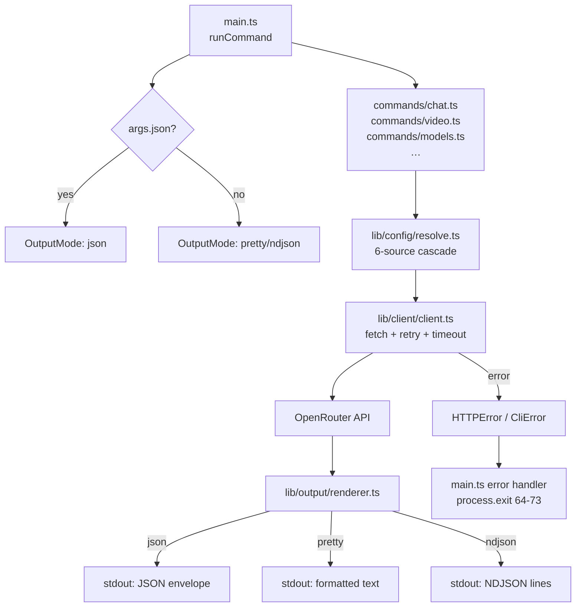
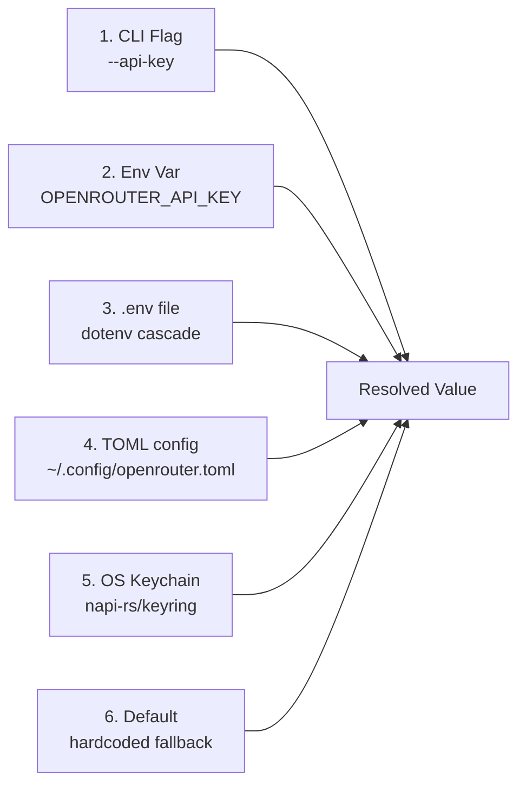
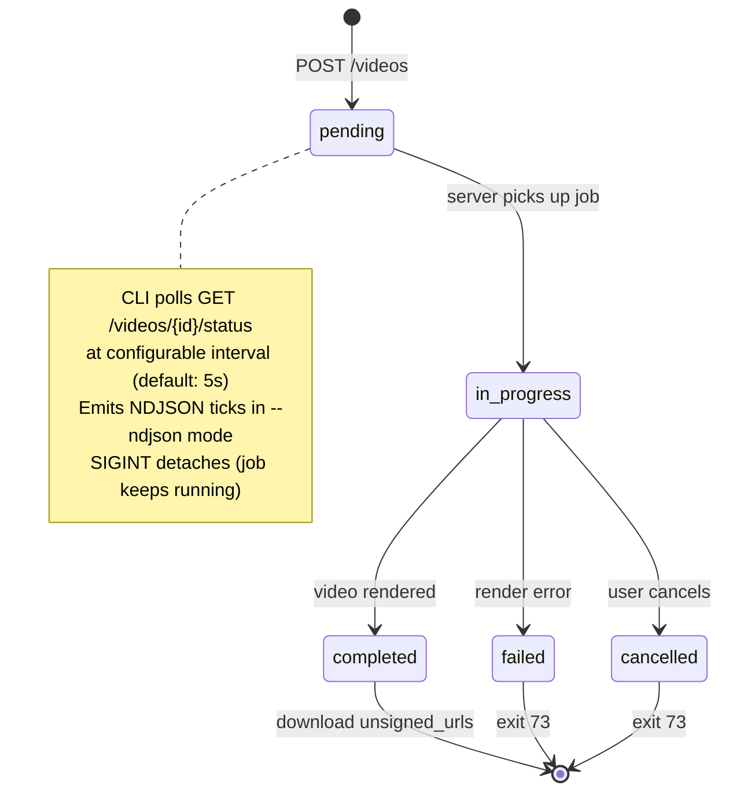

# System Architecture

## Request Lifecycle



## Config Resolution Cascade

Every config value is resolved from 6 sources in priority order (highest first):



Source chain implemented in `src/lib/config/resolve.ts`. Each resolver returns `{ value, source }` for traceability — `openrouter config doctor` displays all sources.

**Default config file location**: `$XDG_CONFIG_HOME/openrouter/config.toml` (or `~/.config/openrouter/config.toml`). Override with `OPENROUTER_CONFIG` env var or `--config` flag.

## Video Job Lifecycle



## Module Boundaries

```
src/
├── main.ts              ← entry, error handler, no business logic
├── commands/            ← one file per noun; no direct HTTP calls
│   └── *.ts               (delegates to lib/client)
└── lib/
    ├── auth/            ← key masking + persistence only
    ├── cache/           ← in-process TTL cache
    ├── chat/            ← request builder + SSE stream handler
    ├── client/          ← HTTP fetch, retry, headers (NO config logic)
    ├── config/          ← resolution cascade + TOML r/w (NO HTTP)
    ├── errors/          ← exit codes + CliError class
    ├── io/              ← stdin reader, duration parser
    ├── oauth/           ← PKCE, loopback server, browser opener
    ├── output/          ← envelope, renderer, table, TTY detect
    ├── tui/             ← interactive prompts (clack)
    ├── types/           ← zod schemas (no side effects)
    ├── ui/              ← spinner, progress bar
    └── video/           ← request builder, poll loop, file download
```

**Dependency rules** (enforced by convention, not tooling):
- `commands/*` may import from `lib/*` but never from other commands
- `lib/client` has NO imports from `lib/config` (config is injected at call sites)
- `lib/types` has NO imports from anything (pure zod schemas)
- `lib/output` has NO imports from `lib/client` (pure formatting)

## Output Formats

| Format | stdout content | When to use |
|--------|---------------|-------------|
| `pretty` | Human-readable text (default on TTY) | Interactive terminal |
| `json` | Full JSON envelope, pretty-printed | Agents, scripting (`--json`) |
| `ndjson` | One JSON object per line | Streaming agents, log pipelines |
| `table` | ASCII table via cli-table3 | List commands with `--output table` |
| `text` | Plain text, no decoration | Machine-readable single values |

All formats wrap data in `schema_version: "1"` envelope for json/ndjson.

### JSON Envelope Structure

**Standard envelope** (most commands):
```json
{
  "schema_version": "1",
  "data": { /* command-specific data */ },
  "meta": { "ok": true, "execution_time_ms": 123 }
}
```

**Config doctor envelope** (fixed 2026-04-18):
```json
{
  "schema_version": "1",
  "data": [
    { "name": "api_key", "source": "keychain", "value": "sk-or-v1-****abcd", "valid": true },
    { "name": "base_url", "source": "default", "value": "https://openrouter.ai/api", "valid": true }
  ],
  "meta": {
    "ok": true,
    "execution_time_ms": 42,
    "config_file": { "exists": true, "path": "/home/user/.config/openrouter.toml" },
    "keychain": { "available": true }
  }
}
```

Consumers must use `envelope.data.find(r => r.name === 'api_key')` and `envelope.meta.config_file`/`envelope.meta.keychain` — NOT `envelope.data.config_file`.

## Binary Build

```
bun build src/main.ts --compile --minify --outfile bin/openrouter
```

Produces a single self-contained binary (no Node/Bun runtime needed at runtime). Targets: macOS arm64, macOS x64, Linux x64, Linux arm64, Windows x64 — built via `scripts/build-binaries.ts`.
